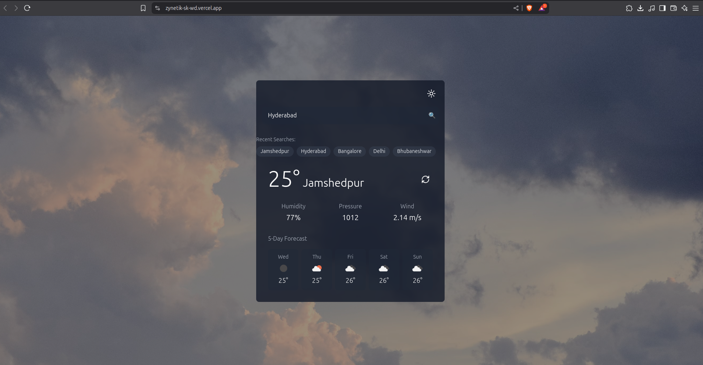

# Zynetik Weather App

A modern, responsive weather application built with React, TypeScript, and Tailwind CSS. This app allows users to search for weather information in any city and displays current conditions along with a 5-day forecast.



## Features

- **Current Weather Data**: View temperature, humidity, pressure, and wind speed for any city
- **5-Day Forecast**: Check the weather forecast for the next 5 days
- **Search History**: Quick access to your recent searches
- **Dark/Light Mode**: Toggle between themes for comfortable viewing in any environment
- **Responsive Design**: Works seamlessly across desktop and mobile devices
- **Beautiful UI**: Clean, minimalist interface with smooth animations

## Tech Stack

- **React 18** - Frontend framework
- **TypeScript** - Type safety and better developer experience
- **Tailwind CSS** - Utility-first CSS framework for styling
- **Framer Motion** - Animation library for smooth transitions
- **Vite** - Fast, modern build tool
- **OpenWeather API** - Weather data provider

## Getting Started

### Prerequisites

- Node.js (v14 or later)
- npm or yarn
- OpenWeather API key

### Installation

1. Clone the repository:
   ```bash
   git clone https://github.com/your-username/zynetik.git
   cd zynetik
   ```

2. Install dependencies:
   ```bash
   npm install
   # or
   yarn
   ```

3. Create a `.env` file in the root directory with your OpenWeather API key:
   ```
   VITE_API_KEY=your_api_key_here
   ```

4. Start the development server:
   ```bash
   npm run dev
   # or
   yarn dev
   ```

5. Open your browser and navigate to `http://localhost:5173`

## Build for Production

To create a production build:
```bash
npm run build
# or
yarn build
```

The build files will be located in the `dist` directory.

## Project Structure

```
zynetik/
├── src/
│   ├── components/           # UI components
│   ├── context/              # React context for state management
│   ├── hooks/                # Custom React hooks
│   ├── types/                # TypeScript type definitions
│   ├── App.tsx               # Main application component
│   └── main.tsx              # Application entry point
├── public/                   # Static assets
└── ...config files           # Various configuration files
```

## How It Works

1. Enter a city name in the search bar
2. The app fetches current weather and forecast data from the OpenWeather API
3. Results are displayed with a clean, intuitive interface
4. Your search is saved locally for quick access later
5. Toggle between dark and light themes as needed

## Deployment

This project is configured for easy deployment to Vercel. Simply connect your GitHub repository to Vercel and it will automatically deploy your application.

Remember to add your `VITE_API_KEY` as an environment variable in your deployment settings.

## License

This project is licensed under the MIT License - see the [LICENSE](LICENSE) file for details.

## Contributing

Contributions are welcome! Feel free to open issues or submit pull requests to help improve this project.

1. Fork the repository
2. Create your feature branch (`git checkout -b feature/amazing-feature`)
3. Commit your changes (`git commit -m 'Add some amazing feature'`)
4. Push to the branch (`git push origin feature/amazing-feature`)
5. Open a Pull Request

## Acknowledgments

- [OpenWeather API](https://openweathermap.org/api) for providing weather data
- [Unsplash](https://unsplash.com) for background images
- Icons provided by [Lucide React](https://lucide.dev)
